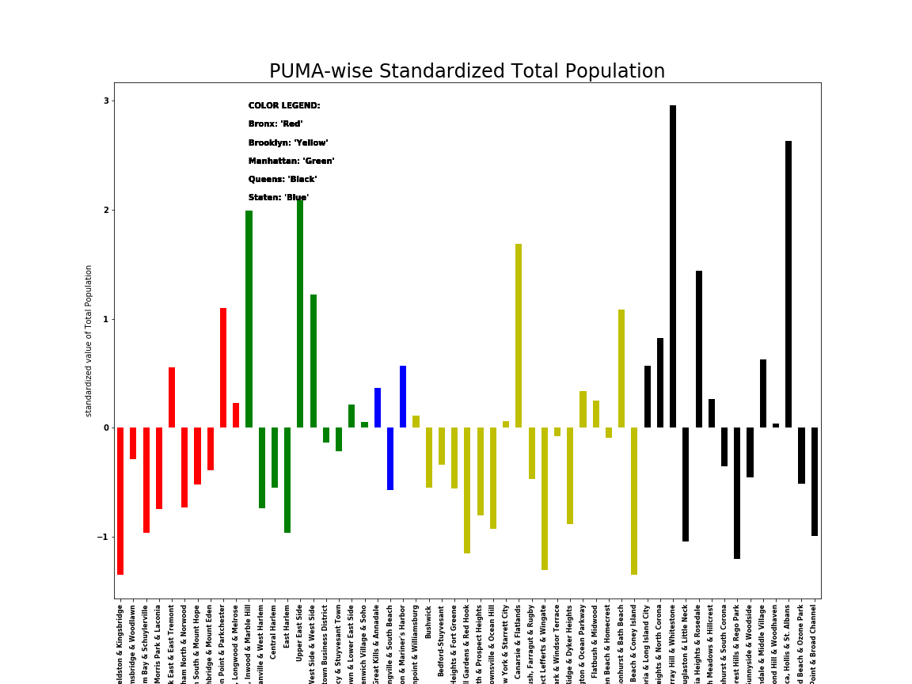
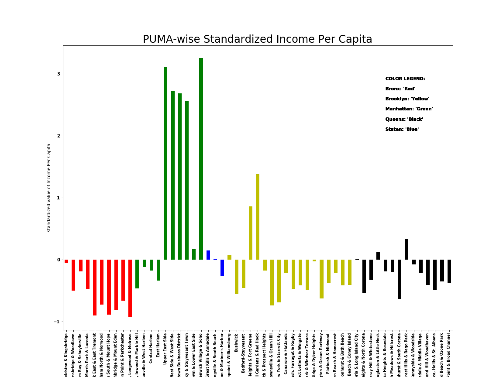
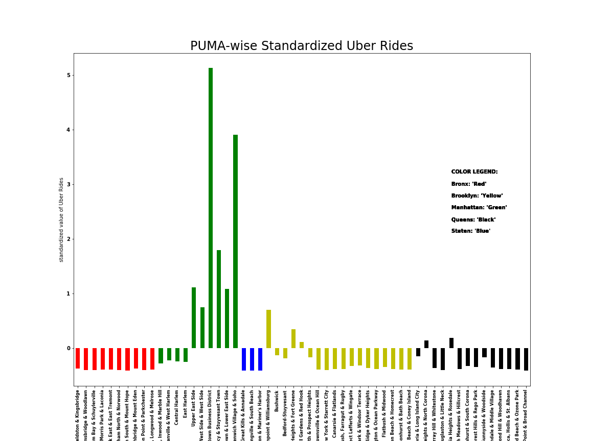

# PUI2018 HW 11

## ASSIGNMENTS:
I worked on all problems by myself.

### Assignment 1. Work from the [skeleton notebook](https://github.com/fedhere/PUI2018_fb55/blob/master/HW11_fb55/subway_timeseries_instructions2.ipynb) with inline instructions.
**Turn in as a notebook on your repo, as usual**, you can work in groups as usual, have a statement of the work balance in the group as usual.

### Assignment 2. Improve your plot from HW8 based on the feedback you recieved from your classmates (let me know if you did not recieve feedback and I will comment on your original plot)

PUMA wise Total Population as standardized values

PUMA wise income per capita as standardized values

PUMA wise ridership count as standardized values
  
1. I divided up the plot to three different ones so I can make each plot present less amount of data
2. I colored them by borough so it's easier to spot borough-wise differences, and x-axis are may be easier to read/understand if you know which borough the neighborhood is from.