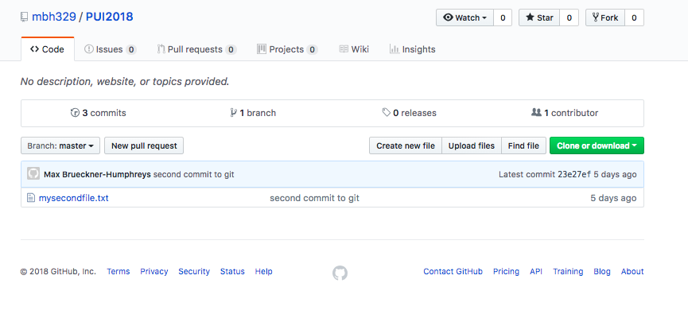
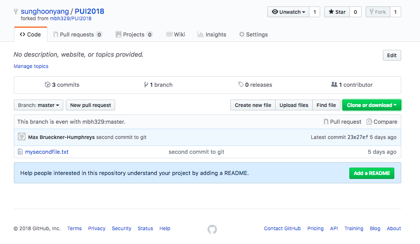
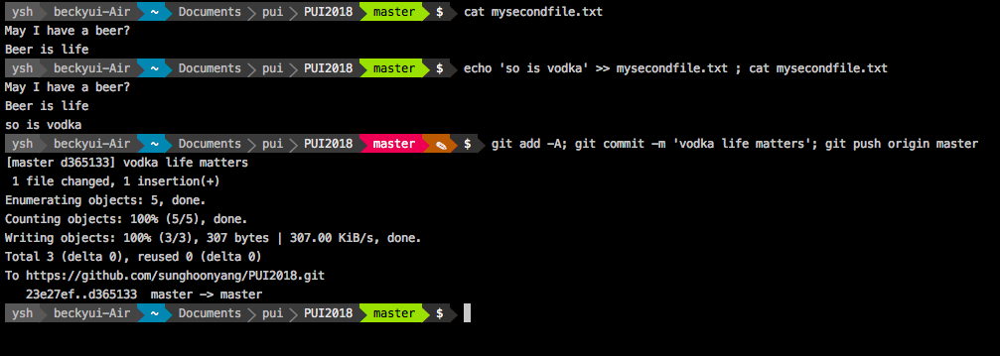
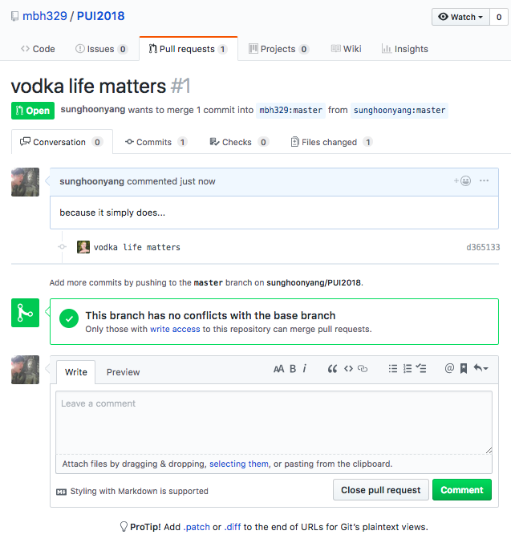
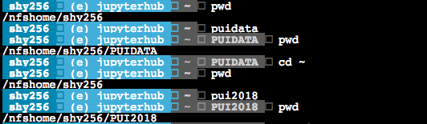
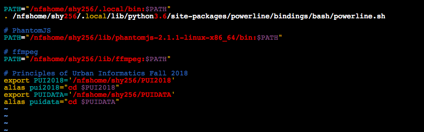

# shy256 submission of PUI 2018 HW 2
## HW1
I am going to send a pull request here

I forked it, and this is my repo

commands are (more or less) as follows:
```bash
# pull my forked repo
git clone https://github.com/sunghoonyang/PUI2018.git
cd PUI2018
# make changes
echo 'so is vodka' >> mysecondfile.txt 
# reflect the change to my forked repo
git add -A
git commit -m 'vodka life matters, oops - merge will have conflict'
git push origin master
```

and made the following pull request 



## HW2

#### Here is the screenshot pair. 
<br>**My Bash Behavior**
<br>Below is the terminal behaviour upon the use of pui* cmds.

<br>**My ~/.bashrc**
<br>Set up as such:


**Extra Credit**<br> 
I submitted it <a href='/HW1_shy256/HW1_3.ipynb'>here</a>

## Reading:

[What does research reproducibility mean? Steven N. Goodman*, Daniele Fanelli and John P. A. Ioannidis](http://stm.sciencemag.org/content/8/341/341ps12 )


## Key Concepts:
reproducible research

basic bash commands

github setup
