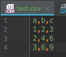
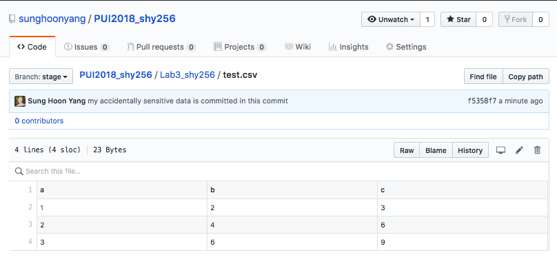
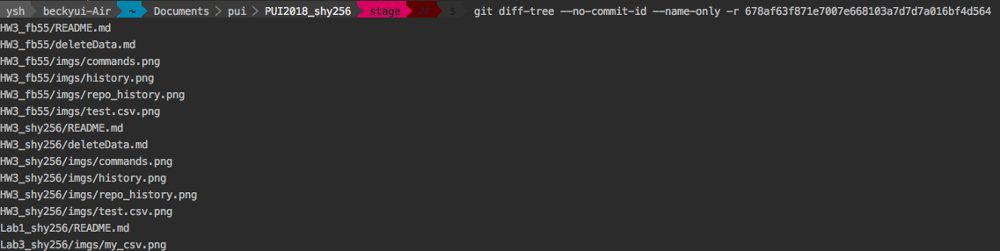
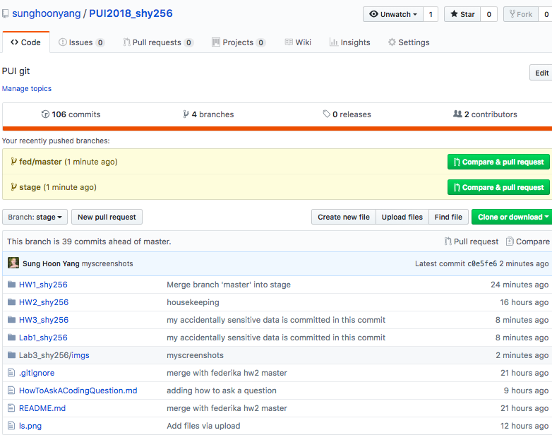
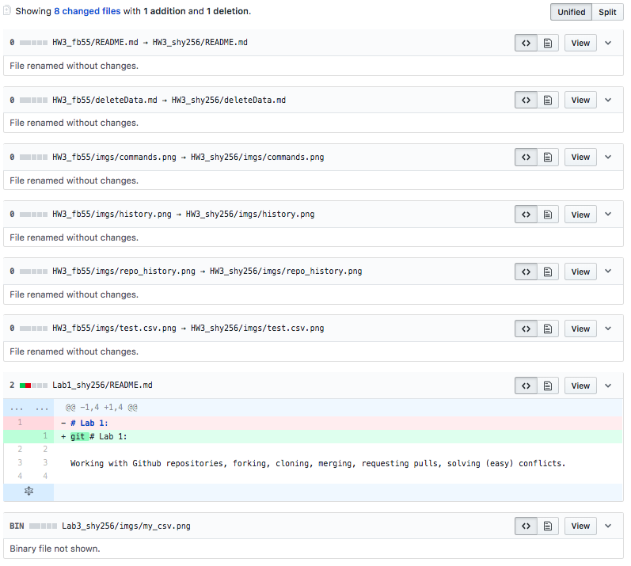

# PUI2018 HW 2.

# Assignment 1: follow te instructions
#### Notice that my mock data was uploaded to Lab3_shy256, not HW3_shy256
##### My sensitive data was conceived like below:

##### It is uploaded with no remorse:

##### Now its existence in my git will be deleted with no remorse:
```bash
# did not save the screenshot...
# ran these cmds
git filter-branch --force --index-filter 'git rm --cached --ignore-unmatch Lab3_shy256/test.csv' --prune-empty --tag-name-filter cat -- --all
git push duke --force --all
``` 
##### test.csv is nowhere to be found in the commit's history

##### remote branch's head displays that my data is gone 

##### remote commit history also does not contain any information regarding test.csv  



# Assignment 2: Read CSV files with pandas
I downloaded dataset: [Open_Parking_and_Camera_Violations](https://data.cityofnewyork.us/Public-Safety/Open-Parking-and-Camera-Violations)
Since, the data is ~1.4M records, I made sample of 100k rows. 
```bash
# header
head -n1 Open_Parking_and_Camera_Violations.csv > Open_Parking_and_Camera_Violations_100k_rows.csv
# shuffle 100k rows
shuf -n 100000 Open_Parking_and_Camera_Violations.csv >> Open_Parking_and_Camera_Violations_100k_rows.csv
# gives 100001
wc -l Open_Parking_and_Camera_Violations_100k_rows.csv
```
Please review the [NoteBook](../HW3_shy256/HW3.ipynb) for the rest of Assignment 2 and Extra Credit

# Assignment 3, 4:  MTA API data processing
Please review [get_bus_info_shy256.py](../HW3_shy256/get_bus_info_shy256.py/Users/ysh/Documents/pui/PUI2018_shy256/HW3_shy256/get_bus_info_shy256.py)
and [show_bus_locations_shy256.py](../HW3_shy256/show_bus_locations_shy256.py)