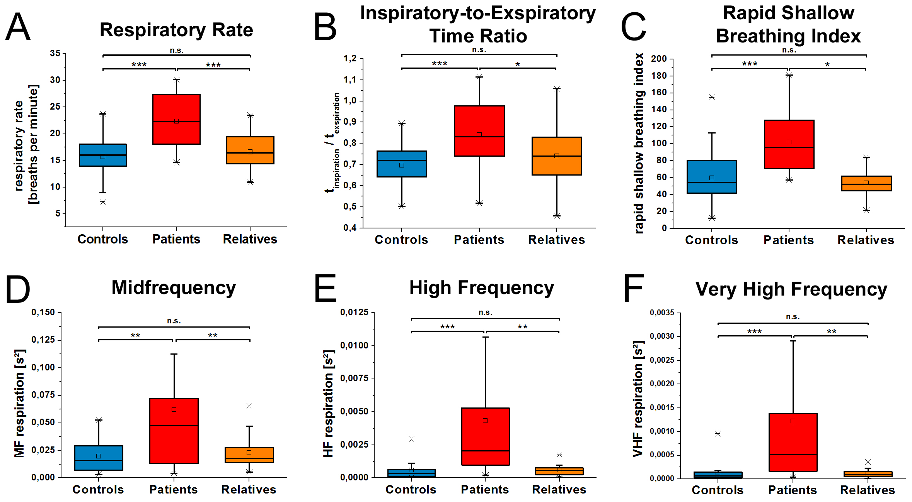
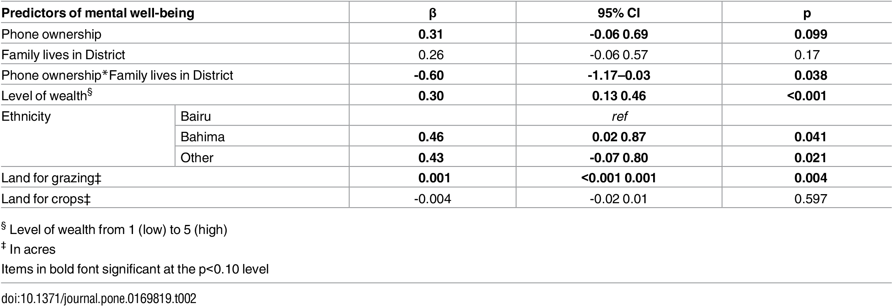

# PUI2018 HW 6 session 2
### Submission Info:

I worked on all problems by myself, except for assignment2

## Assignment 2: Literature choices of statistical tests
Worked with Max (mbh329)

| **Statistical Analyses**	|  **IV(s)**  |  **IV type(s)** |  **DV(s)**  |  **DV type(s)**  |  **Control Var** | **Control Var type**  | **Question to be answered** | **_H0_** | **alpha** | **link to paper**| 
|:----------:|:----------|:------------|:-------------|:-------------|:------------|:------------- |:------------------|:----:|:-------:|:-------|
ANCOVA	| 1, Ranks of values | ordinal | 1, did Self Affirmation or no| categorical | 1, age | continuous (could also be categorical) | 	Do participants in self-affirmation rak  value significantly higher than control group | Ranks test groups <= Ranks control group | 0.05 | [Self-Affirmation Improves Problem-Solving under Stress](http://journals.plos.org/plosone/article?id=10.1371/journal.pone.0062593) |
MANCOVA  |difference in parameters between control and patient groups|real number|Respiratory rate, Heart Rate Variability, Tidal Volume, HF high frequency, LF low freq., minute ventilation, blood oxygen saturation level|continuous|sickness indicator|categorical|are there differences for respiratory parameters (breathing rate, rapid shallow breathing index, minute volume, ratio of inspiration and exhalation, RMMSDResp, LFResp, MFResp, HFResp, VHF1Resp, tidal volume, RMMSDTV, LFTV, HFTV) between all three groups?|$$H_0: parameter_{control} = parameter_{patient}$$|0.001|[The Phrenic Component of Acute Schizophrenia – A Name and Its Physiological Reality](https://journals.plos.org/plosone/article?id=10.1371/journal.pone.0033459)
Spearman’s rank correlation  |self-reported wealth|continuous|primary livelihood, ethnicity, self-reported wealth ranking, acres of land (used for crops and/or grazing), sanitation facilities, education level of both parents, primary expenditures, frequency of requests for assistance (financial or otherwise) to family members and/or others in the past year, and whether family lives within the District or beyond.|continuous and categorical (e.g. education level)|mobile phone ownership|indicator variable (categorical)|self-reported wealth was significantly, positively correlated with other indicators of wealth|$$H_0: \rho = 0 $$ | p \sim 0.013 | [Mobile Phones and Mental Well-Being: Initial Evidence Suggesting the Importance of Staying Connected to Family in Rural, Remote Communities in Uganda](https://journals.plos.org/plosone/article?id=10.1371/journal.pone.0169819)
  
Include the main plot of the paper (the plot that summarized the result)

Figure 1. Parameters of respiratory analysis of controls, patients and relatives are presented.
The pattern of significantly altered values of patients in comparison to controls is represented in A–F. The increased breathing rate of patients is presented in A. As shown in B, the inspiratory-to-expiratory time ratio is increased in patients indicating a reduction of the exhalation time. Patients breathe shallowly as indicated in C. Most pronounced are increased frequency bands of respiration as indicated in D–F. Boxes indicate data between the 25th and 75th percentile with the horizontal bar reflecting the median (□ = mean; - = 1st and 99th percentile; x = minimum and maximum of data). Significant differences of Bonferoni corrected pair-wise comparisons are indicated: * p<.05; ** p<.01; *** p<.001

Table 2. Results for multiple linear regression model predicting mental well-being.

