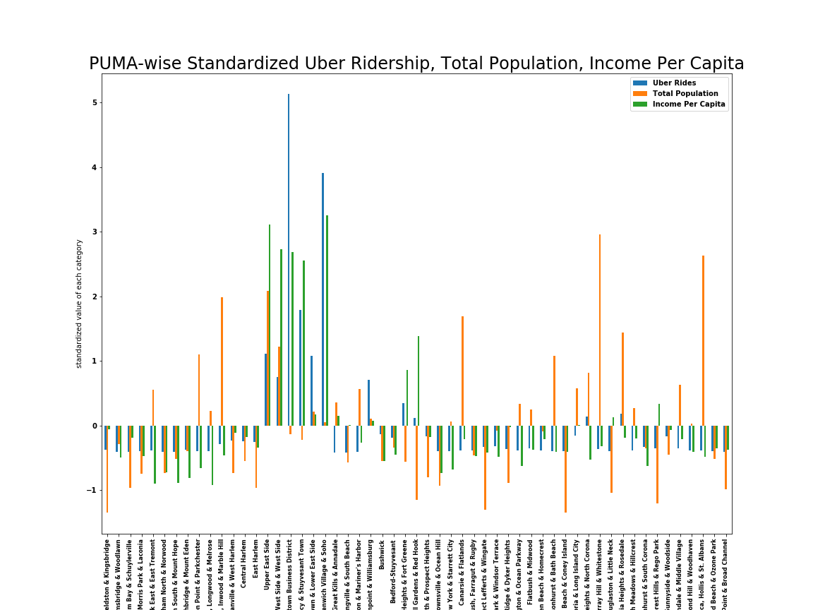

# Reading
[7 Great Visualizations from History](http://data-informed.com/7-great-visualizations-history)

[6 lessons from the Bauhaus](http://blog.visual.ly/six-lessons-from-the-bauhaus-masters-of-the-persuasive-graphic)

# Assignments
## Assignment 1

The graph shows that the distribution of population amongst PUMA is not at at positively related to the other two variables, income per capita and uber rides. Uber rideship counts and income per capita, on the other hand, together exhibit a strong positive correlation. I think that this is especially so, because all the Uber data lat/lon pairs only give us information about a individual ride's starting geolocation. Therefore, it makes sense to assume that the neighborhoods with more income are more likely to start their journey with a uber ride as opposed to a cheaper transportation alternative.
## Assignment 2
[Go to Authorea Report](https://www.authorea.com/335980/EVyJLXyvBMRJkZddsXEp9Q)