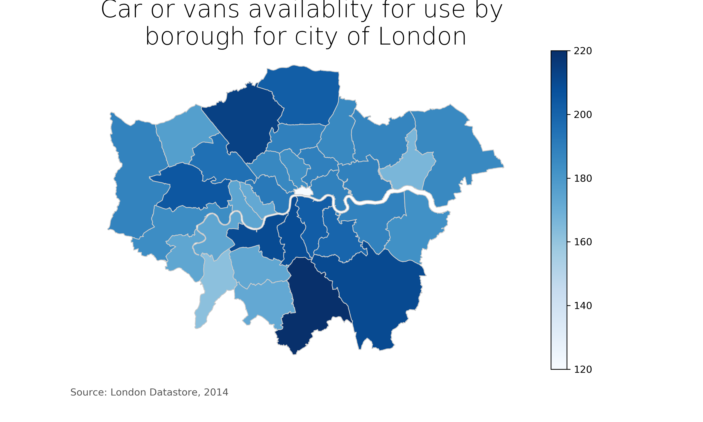

The plot captures the greatest concentration of availability in the mid-south region of London, whose center may be found in the southernmost boundary. The northern region also exhibits high availability of cars and vans. The center of London, on the other hand does not exhibit such high availability. The plot's colormap is intuitive because it has a *blue* scale that only darkens with the increasing intensity of the availability. It will be easier to describe the plot if the regions are annotated with names or indices. I am also not completely sure of the scale of the plot, although I am assuming that the colormap is in the unit of vehicle.